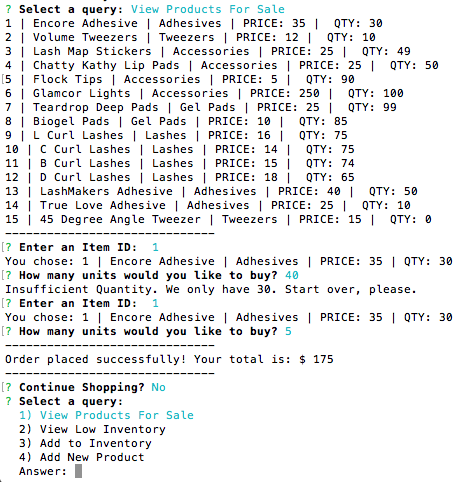

#BAMAZON MANAGER 
## An NODE inventory management application.

###How it Works
----------------
1. Select a Query
2. View Products for Sale
3. View Low Inventory
4. Add to Inventory
5. Add New Product

####Select a query
-------------------

####View Products for Sale
---------------------
If a manager selects __View Products for Sale__, the app will list every available item: the item IDs, names, prices, and quantities.

If there is enough product, the order will be successful.

Otherwise, the manager will be notified Insufficient Quantity and prompted to start over.

####View Low Inventory
-------------
If a manager selects __View Low Inventory__, it will list all items with an inventory count lower than 50. The manager will also have the option to add inventory.

####Add to Inventory
---------
If a manager selects __Add to Inventory__, it will display a prompt that will let the manager "add more" of any item currently in the database.

####Add New Product
-----------
If a manager selects __Add New Product__, it will allow the manager to add a completely new product to the store.

####Created with :heart: using:
----------------
:heavy_plus_sign: MYSQL
:heavy_plus_sign: MYSQL Workbench
:heavy_plus_sign: Javascript
:heavy_plus_sign: Node

