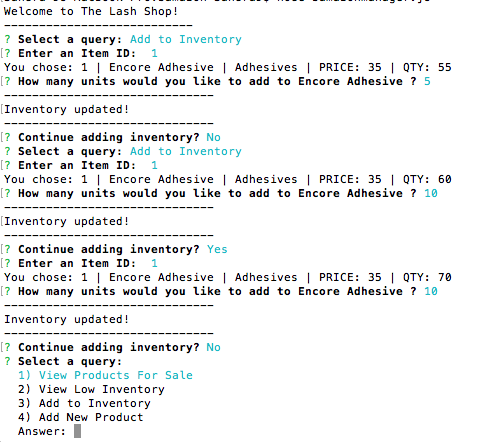

#BAMAZON MANAGER 
## An NODE inventory management application.

## Quick Links
------
1. [Select a Query](#query)
2. [View Products for Sale](#forsale)
3. [View Low Inventory](#lowinv)
4. [Add to Inventory](#addinv)
5. [Add New Product](#addnew)

####:one:Select a query
-------------------

[Back to quick links](#quick)

####:two:View Products for Sale
---------------------
If a manager selects __View Products for Sale__, the app will list every available item: the item IDs, names, prices, and quantities.

If there is enough product, the order will be successful.

Otherwise, the manager will be notified Insufficient Quantity and prompted to start over.

[Back to quick links](#quick)

####:three:View Low Inventory
-------------
If a manager selects __View Low Inventory__, it will list all items with an inventory count lower than 50. The manager will also have the option to add inventory.

[Back to quick links](#quick)

####:four:Add to Inventory
---------
If a manager selects __Add to Inventory__, it will display a prompt that will let the manager "add more" of any item currently in the database.

[Back to quick links](#quick)

####:five: Add New Product
-----------
If a manager selects __Add New Product__, it will allow the manager to add a completely new product to the store.

[Back to quick links](#quick)

####Created with :heart: using:
----------------
:heavy_plus_sign: MYSQL
:heavy_plus_sign: MYSQL Workbench
:heavy_plus_sign: Javascript
:heavy_plus_sign: Node
:heavy_plus_sign: Sublime Text w/ Markdown Preview & Editing
[Back to quick links](#quick)

